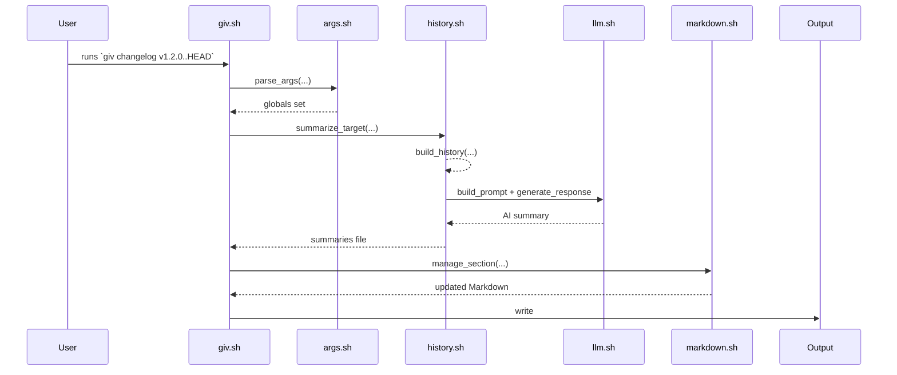
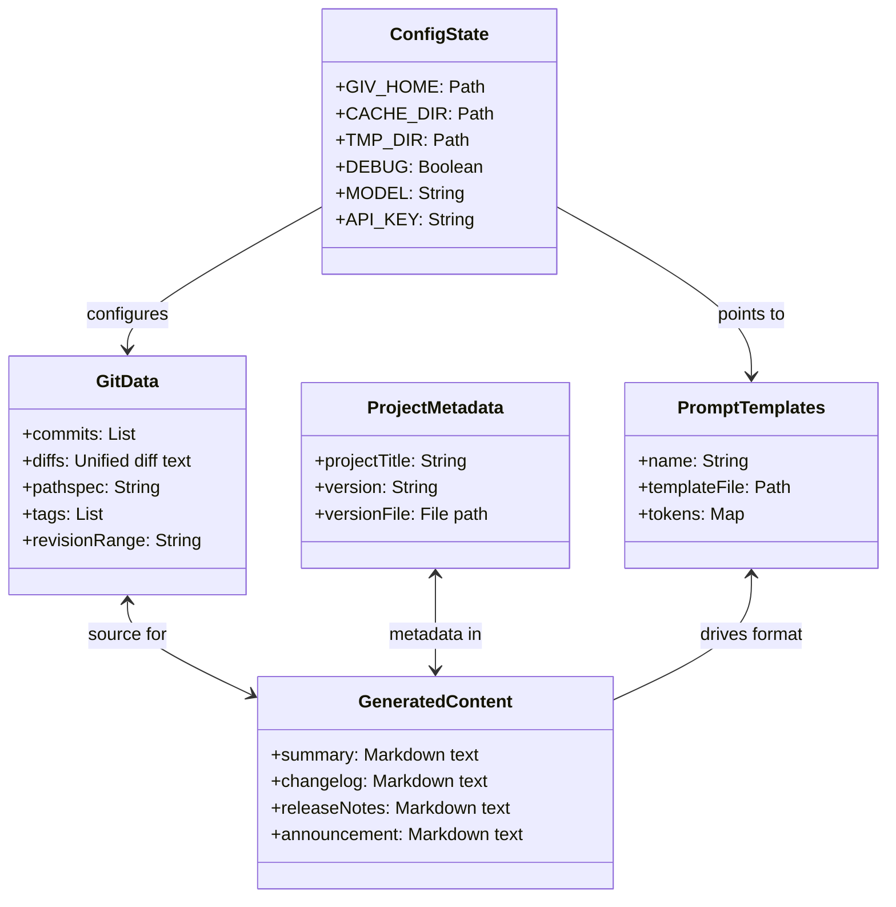
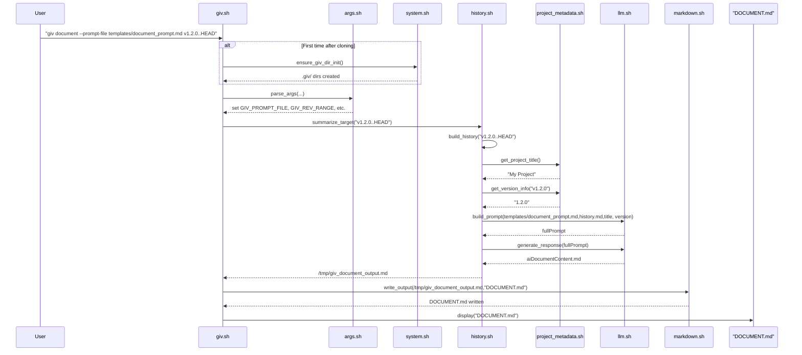

# Architecture

## Overview

giv is a Python-based CLI tool compiled into standalone binaries for cross-platform distribution. The tool maintains the same command-line interface as the original Bash implementation while providing improved performance, reliability, and cross-platform compatibility.

## Binary Distribution Architecture

The tool is distributed as self-contained executables built using PyInstaller:

- **Single binary**: All dependencies bundled into one executable
- **No runtime dependencies**: Python runtime and all libraries included
- **Cross-platform**: Separate binaries for Linux, macOS, and Windows
- **Architecture support**: x86_64 and ARM64 for Linux/macOS

### Supported Platforms

| Platform | Architecture | Binary Name |
|----------|-------------|-------------|
| Linux | x86_64 | `giv-linux-x86_64` |
| Linux | ARM64 | `giv-linux-arm64` |
| macOS | x86_64 (Intel) | `giv-darwin-x86_64` |
| macOS | ARM64 (Apple Silicon) | `giv-darwin-arm64` |
| Windows | x86_64 | `giv-windows-x86_64.exe` |

## Python Implementation Architecture

The Python implementation follows a modular architecture with clear separation of concerns:

### Core Components

- **CLI Layer** (`giv/cli.py`): Argument parsing and command dispatch
- **Configuration** (`giv/config.py`): Git-style configuration management
- **Git Integration** (`giv/git_utils.py`): Git operations and history extraction
- **LLM Client** (`giv/llm_utils.py`): AI model integration (local/remote)
- **Template Engine** (`giv/template_utils.py`): Prompt template processing
- **Output Management** (`giv/output_utils.py`): File writing with various modes
- **Project Metadata** (`giv/project_metadata.py`): Version and project information
- **Markdown Processing** (`giv/markdown_utils.py`): Markdown utilities

### Command Architecture

All subcommands follow a consistent pattern:
1. Parse arguments and load configuration
2. Extract Git data (diffs, commits, metadata)
3. Build prompt from template with context
4. Generate content using LLM client
5. Write output using appropriate mode

### Compilation Process

The Python source is compiled using PyInstaller with these optimizations:

- **One-file bundle**: Single executable with all dependencies
- **Static linking**: No external library dependencies
- **Optimized imports**: Only required modules included
- **Cross-compilation**: Separate builds for each target platform

## Repository Structure

### Python Package Structure

```
giv_py/
├── giv/                           # Main Python package
│   ├── __init__.py               # Package initialization
│   ├── __main__.py               # Entry point for python -m giv
│   ├── cli.py                    # CLI argument parsing and dispatch
│   ├── config.py                 # Configuration management
│   ├── git_utils.py              # Git operations
│   ├── llm_utils.py              # LLM client
│   ├── template_utils.py         # Template processing
│   ├── output_utils.py           # Output management
│   ├── project_metadata.py       # Project metadata extraction
│   ├── markdown_utils.py         # Markdown utilities
│   └── templates/                # Built-in prompt templates
│       ├── message_prompt.md
│       ├── changelog_prompt.md
│       ├── release_notes_prompt.md
│       └── announcement_prompt.md
├── tests/                        # Test suite
├── docs/                         # Documentation
├── build/                        # Build scripts and configuration
├── pyproject.toml               # Poetry configuration
└── setup.py                    # Build automation

### Build and Distribution

The binary compilation process uses automated build scripts:

```
build/
├── build.py                      # Main build script
├── pyinstaller_config.py         # PyInstaller configuration
├── cross_compile.py              # Cross-platform compilation
└── package_binaries.py           # Package for distribution
```

### Build Process Flow

1. **Source Preparation**: Python source code and templates
2. **Dependency Resolution**: Resolve all Python dependencies
3. **Cross-Compilation**: Build for each target platform
4. **Binary Optimization**: Strip unnecessary components
5. **Package Creation**: Create distribution packages
6. **Release Automation**: Upload to GitHub releases and package managers

### Configuration Management

The `config.py` module implements Git-style configuration:

- **File-based storage**: `.giv/config` in project root
- **Environment variables**: `GIV_*` prefixed variables
- **Command-line overrides**: CLI flags take precedence
- **Cross-platform paths**: Handles Windows/Unix path differences
- **Validation**: Type checking and format validation

### System Utilities

**system.sh** provides logging functions (`print_debug`, `print_info`, etc.), temporary-dir management (`portable_mktemp_dir`, `remove_tmp_dir`), `.giv` directory initialization (`ensure_giv_dir_init`), and location helpers (`find_giv_dir`) ([system.sh][3]).

### Argument Parsing

**args.sh** defines `show_help` and `parse_args`, mapping CLI options to `GIV_*` variables, validating revisions/pathspecs, handling config files early, and configuring local vs remote AI modes ([args.sh][4]).

### Markdown Handling

**markdown.sh** implements `manage_section` for append/prepend/update of Markdown sections, `append_link` to add links, utilities for stripping and normalizing Markdown (`strip_markdown`, `normalize_blank_lines`), and Markdown viewing via `glow` (with fallback to `cat` if unavailable) ([markdown.sh][5]).

### LLM Integration

**llm.py** handles JSON-escaping (`json_escape`), remote API calls (`generate_remote` via curl), local inference (`run_local`), response parsing (`extract_content_from_response`), and high-level `generate_response`, along with prompt token replacement (`replace_tokens`), prompt building (`build_prompt`), and execution (`generate_from_prompt`). It includes robust error handling and a fallback to `jq` for JSON parsing ([llm.sh][6]).

### Centralized Metadata Retrieval

**project_metadata.sh** includes a centralized function, `get_metadata_value`, which retrieves metadata values (e.g., version, title) based on the project type. This function is used across scripts like `history.sh` and `llm.sh` to ensure consistent and modular metadata management. The project type is detected during initialization and stored in the configuration for runtime use.

### History Extraction

**history.sh** provides utilities for summarizing Git history, extracting TODO changes, and caching summaries. It consolidates diff logic in a single `get_diff` function and ensures strict error handling and cleanup of temporary files ([history.sh][8]).

### Subcommand Implementations

Each subcommand in the `giv` CLI is implemented as a separate `.sh` script located in the `src/commands/` folder. The main `giv.sh` script detects the subcommand and delegates execution to the corresponding script. The architecture has recently evolved to support a more generic and modular approach:

1. **Generic Document Driver (`document.sh`)**:
   - Subcommands like `announcement.sh`, `release-notes.sh`, and `summary.sh` now act as thin wrappers that delegate their functionality to `document.sh`.
   - These scripts pass specific templates (e.g., `announcement_prompt.md`, `release_notes_prompt.md`, `final_summary_prompt.md`) to `document.sh` for processing.
   - The `document` subcommand itself allows arbitrary prompt files via `--prompt-file`, supporting custom document types and workflows.

2. **Direct Implementations**:
   - Scripts like `changelog.sh` and `message.sh` currently implement their logic directly, but there is an ongoing migration to unify all document-like subcommands under the generic driver for consistency and maintainability.
   - These scripts handle argument parsing, Git history summarization, and AI prompt generation within the script.

3. **Shared Functionality**:
   - Common argument parsing and utility functions are provided by `document_args.sh` and other shared scripts. The new `parse_document_args` function is used for all document-related subcommands to ensure consistent flag handling (e.g., `--prompt-file`, `--project-type`).

4. **Execution Flow and Error Handling**:
   - The main `giv.sh` script identifies the subcommand and executes the corresponding `.sh` file from the `commands` folder.
   - If the subcommand script is not found, an error message is displayed with a list of available subcommands.
   - All subcommands now include improved error handling: missing dependencies, invalid config, or failed AI calls are surfaced to the user with clear messages and exit codes. Optional dependencies (e.g., Glow, GitHub CLI) are checked at runtime, and warnings are issued if unavailable.

This modular structure ensures that each subcommand is self-contained and easy to maintain, while shared functionality is centralized for reuse. The ongoing migration aims to further unify subcommand logic and reduce duplication.
## Testing and Error Handling

- The project includes an extensive test suite under `tests/`, covering all major workflows and edge cases. Tests are run in sandboxed environments to ensure reliability and portability.
- Error handling is robust: missing dependencies, invalid config, or failed AI calls result in clear user-facing messages and non-zero exit codes. Warnings are issued for optional but recommended settings.
- Users can opt for manual review before saving generated content, providing an additional layer of safety.

---

These updates ensure the documentation accurately reflects the current and planned architecture, workflows, error handling, and testing strategy of the giv CLI tool.

## Data Domains

1. **Git Data**: Commits, diffs, staged/unstaged changes, untracked files, commit dates, tags and ranges (handled by `build_diff`, `get_commit_date`, Git plumbing) ([history.sh][8]).
2. **Project Metadata**: Version files (`package.json`, etc.), extracted versions (`get_version_info`), and project titles (`get_project_title`) ([project_metadata.sh][7]).
3. **AI Prompt Templates**: Markdown templates stored under `templates/` (e.g. `summary_prompt.md`, `changelog_prompt.md`, `release_notes_prompt.md`, `announcement_prompt.md`) ([giv.sh][1]).
4. **Generated Content**: Summary Markdown, commit messages, changelogs, release notes, announcements, managed under `.giv/cache` and output files in project root ([system.sh][3]) ([history.sh][8]).
5. **Configuration & State**: Stored in `.giv/config`, `.giv/cache`, `.giv/.tmp`, and optionally `.giv/templates` (after `init`) ([system.sh][3]).

## Workflows

### Commit Summarization

The `summarize_commit` function in **history.sh** orchestrates:

1. Generating raw history with `build_history`.
2. Finding version info via `get_version_info`.
3. Building an AI prompt (`build_prompt` with `commmit_summary_prompt.md`).
4. Generating the summary (`generate_response`).
   Caching ensures repeated calls skip regeneration ([history.sh][8], [llm.sh][6]).

### Changelog Generation

`changelog` in **commands/changelone.sh** follows:

1. Summarize commits/ranges with `summarize_target`.
2. Build the changelog prompt (`changelog_prompt.md`) via `build_prompt`.
3. Generate content (`generate_from_prompt`).
4. Update `CHANGELOG.md` using `manage_section` and append a “Managed by giv” link ([commands/changelog.sh][9]).

### Release-Notes & Announcements

Both use the generic `document.sh` subcommand as their driver:

1. Summarize history into temp file.
2. Build prompt from `release_notes_prompt.md` or `announcement_prompt.md`.
3. Call `generate_from_prompt` with tailored temperature and context window.
4. Output to `RELEASE_NOTES.md` or `ANNOUNCEMENT.md`.

### Generic Document Generation

The `document` subcommand invokes `document.sh` with a user-supplied `--prompt-file`, enabling arbitrary AI-driven reports over any revision/pathspec.

## Architecture Diagrams

### Sequence Diagram



### Class Diagram

```mermaid
classDiagram
    class giv.sh {
        +get_script_dir()
        +parse_args()
        +dispatch()
    }
    class system.sh {
        - export GIV_*
        +print_debug()
        +portable_mktemp_dir()
        +ensure_giv_dir_init()
    }
    class args.sh {
        +parse_args()
        +show_help()
    }
    class markdown.sh {
        +manage_section()
        +append_link()
    }
    class llm.sh {
        +generate_response()
        +build_prompt()
    }
    class project_metadata.sh {
        +get_project_title()
        +get_version_info()
        +get_metadata_value()
    }
    class history.sh {
        +build_history()
        +summarize_commit()
    }
    class "commands/*.sh" {
        +changelog.sh
        +document.sh
        +message.sh
        +announcement.sh
        +release-notes.sh
        +summary.sh
    }

    giv.sh --> init.sh
    giv.sh --> system.sh
    giv.sh --> args.sh
    giv.sh --> markdown.sh
    giv.sh --> llm.sh
    giv.sh --> project_metadata.sh
    giv.sh --> history.sh
    giv.sh --> "commands/*.sh"
    "commands/*.sh" --> history.sh
    "commands/*.sh" --> llm.sh
    "commands/*.sh" --> markdown.sh
    history.sh --> project_metadata.sh
    llm.sh --> project_metadata.sh
    markdown.sh --> system.sh
```

This should give you a clear view of how the scripts interconnect, the data each component handles, and the flow of execution through the tool.

[1]: /src/giv.sh "giv.sh"
[2]: /src/system.sh "system.sh"
[3]: /src/system.sh "system.sh"
[4]: /src/args.sh "args.sh"
[5]: /src/markdown.sh "markdown.sh"
[6]: /src/llm.sh
[7]: /src/project_metadata.sh
[8]: /src/history.sh
[9]: /src/commands/

Across the giv-CLI tool, there are five primary **data domains**—each holding specific values—and the `document` subcommand orchestrates several modules in a well-defined call sequence. Below is a data-structure diagram showing the domains and their key contents, then a detailed sequence diagram illustrating exactly how `giv document` runs under the hood.

---

## Data Domains and Their Contents



* **GitData**: all raw Git artifacts (commits, diffs, tags, revision ranges, pathspecs) used to build histories and summaries.
* **ProjectMetadata**: extracted from files like `package.json` or `pyproject.toml`—contains project title and version info.
* **PromptTemplates**: stored under `templates/`, each named (e.g. `summary_prompt.md`, `changelog_prompt.md`, `document_prompt.md`) with substitution tokens.
* **GeneratedContent**: the AI-produced Markdown blobs (commit messages, changelogs, release notes, documents, announcements).
* **ConfigState**: CLI configuration and state in `.giv/` (home, cache, temp dirs), debug flags, AI model choice, API credentials.

---

## Sequence of `giv document --prompt-file <file> <range>`



1. **Initialization** (once): creates `.giv/` directory.
2. **Argument Parsing**: `args.sh` sets up global vars (prompt file, revision range).
3. **History Extraction**: `history.sh` builds a unified history for the given range, invoking `project_metadata.sh` for title/version.
4. **Prompt Assembly**: `llm.sh` merges the template, history, and metadata into a single prompt.
5. **AI Generation**: same module calls out to remote/local LLM, returns the document text.
6. **Output**: `markdown.sh` writes the result to `DOCUMENT.md` and the CLI presents it.

These diagrams and explanations should give you a clear map of **what data lives where** and **how the `document` flow unfolds** end-to-end.
