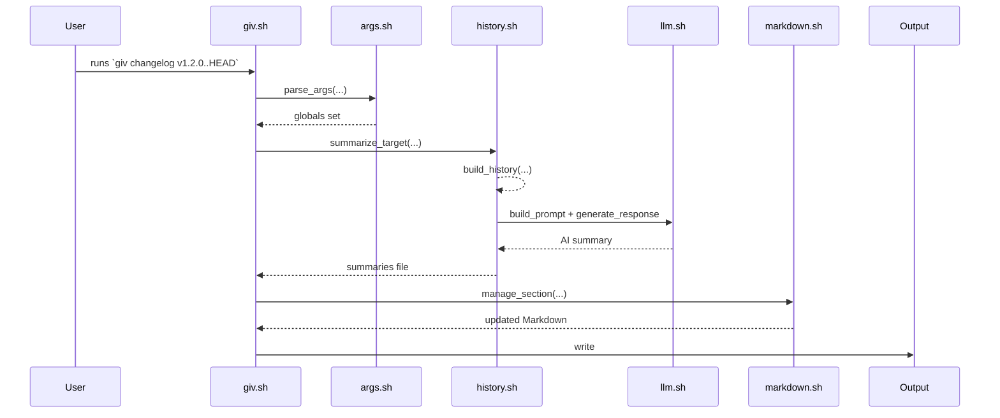
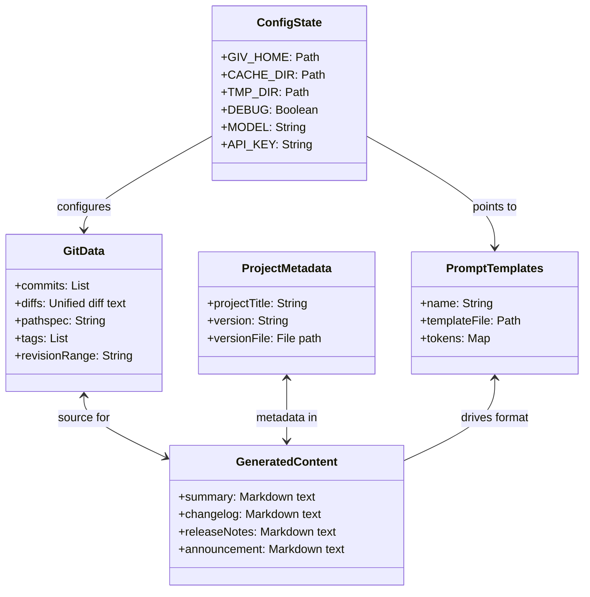
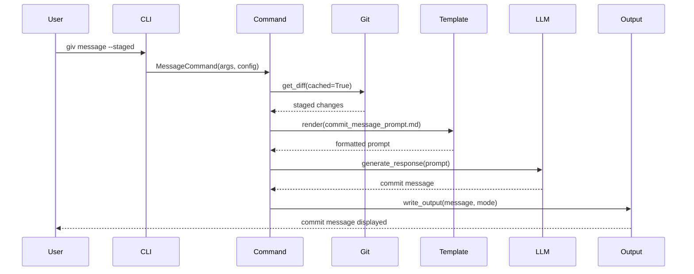

# Architecture

## Overview

giv is a Python-based CLI tool compiled into standalone binaries for cross-platform distribution using GitHub Actions automation. The tool provides an intelligent Git history assistant with AI-powered commit message generation, changelog creation, and release note automation.

## Binary Distribution Architecture

The tool is distributed as self-contained executables built using PyInstaller via GitHub Actions:

- **Single binary**: All dependencies bundled into one executable
- **No runtime dependencies**: Python runtime and all libraries included
- **Cross-platform**: Separate binaries for Linux, macOS, and Windows
- **Architecture support**: x86_64 and ARM64 for Linux/macOS
- **Automated builds**: GitHub Actions matrix builds for all platforms

### Supported Platforms

| Platform | Architecture | Binary Name | Build Method |
|----------|-------------|-------------|--------------|
| Linux | x86_64 | `giv-linux-x86_64` | Native build |
| Linux | ARM64 | `giv-linux-arm64` | Cross-compilation |
| macOS | x86_64 (Intel) | `giv-macos-x86_64` | Native build |
| macOS | ARM64 (Apple Silicon) | `giv-macos-arm64` | Native build |
| Windows | x86_64 | `giv-windows-x86_64.exe` | Native build |

## Python Implementation Architecture

The Python implementation follows a modular architecture with clear separation of concerns:

### Core Components

- **CLI Layer** (`giv/cli.py`): Argument parsing and command dispatch
- **Command System** (`giv/commands/`): Individual command implementations inheriting from BaseCommand
- **Configuration** (`giv/config.py`): Git-style hierarchical configuration management
- **Git Integration** (`giv/lib/git.py`): Git operations and history extraction
- **LLM Client** (`giv/lib/llm.py`): AI model integration (local/remote)
- **Template Engine** (`giv/lib/templates.py`): Prompt template processing with multi-source discovery
- **Output Management** (`giv/lib/output.py`): File writing with various modes (append/prepend/update)
- **Metadata Extraction** (`giv/lib/metadata.py`): Project version and information detection
- **Markdown Processing** (`giv/lib/markdown.py`): Markdown utilities and section management

### Command Architecture

All subcommands follow the BaseCommand pattern:
1. Inherit from `BaseCommand` with consistent constructor pattern
2. Use `argparse.Namespace` + `ConfigManager` for configuration
3. Override `customize_context()` to modify template variables
4. Override `handle_output()` to customize file writing behavior
5. Auto-discover templates via `template_name` attribute

### Build and Release Architecture

The compilation and distribution process uses GitHub Actions automation:

#### GitHub Actions Workflows

1. **`.github/workflows/build.yml`** - Main CI workflow
   - Multi-Python version testing (3.8-3.12)
   - Calls `build-ci.yml` for binary validation
   - Dependency caching for fast feedback

2. **`.github/workflows/build-ci.yml`** - CI binary builds
   - x86_64 platforms only for speed
   - Test execution before building
   - Short artifact retention

3. **`.github/workflows/build-binaries.yml`** - Production builds
   - Full platform matrix including ARM64
   - Cross-compilation for Linux ARM64
   - Checksum generation and validation

4. **`.github/workflows/release.yml`** - Release automation
   - Automated PyPI publishing (test and production)
   - Package manager configuration generation
   - GitHub release creation with all assets

## Repository Structure

### Python Package Structure

```
giv_py/
├── giv/                           # Main Python package
│   ├── __init__.py               # Package initialization
│   ├── __main__.py               # Entry point for python -m giv
│   ├── cli.py                    # CLI argument parsing and dispatch
│   ├── config.py                 # Hierarchical configuration management
│   ├── constants.py              # Template constants and error codes
│   ├── errors.py                 # Custom exception classes
│   ├── main.py                   # Main entry point
│   ├── commands/                 # Command implementations
│   │   ├── __init__.py          # Command discovery and registration
│   │   ├── base.py              # BaseCommand abstract class
│   │   ├── message.py           # Commit message generation
│   │   ├── changelog.py         # Changelog generation
│   │   ├── release_notes.py     # Release notes generation
│   │   ├── announcement.py      # Announcement generation
│   │   ├── config.py            # Configuration management commands
│   │   ├── init.py              # Project initialization
│   │   └── version.py           # Version display
│   ├── lib/                     # Core library modules
│   │   ├── __init__.py
│   │   ├── git.py               # Git operations and history
│   │   ├── llm.py               # LLM client integration
│   │   ├── templates.py         # Template engine and discovery
│   │   ├── output.py            # Output management with modes
│   │   ├── metadata.py          # Project metadata extraction
│   │   ├── markdown.py          # Markdown processing utilities
│   │   ├── repository.py        # Repository detection and analysis
│   │   ├── summarization.py     # Content summarization
│   │   ├── todo.py              # TODO scanning and analysis
│   │   └── utils.py             # Common utilities
│   └── templates/               # Built-in prompt templates
│       ├── commit_message_prompt.md
│       ├── changelog_prompt.md
│       ├── release_notes_prompt.md
│       └── announcement_prompt.md
├── tests/                        # Comprehensive test suite
├── docs/                         # Documentation
├── build/                        # Build scripts and automation
├── .github/workflows/            # GitHub Actions CI/CD
├── pyproject.toml               # Poetry configuration with TestPyPI
└── poetry.lock                  # Locked dependencies
```

### Build and Distribution Infrastructure

```
.github/workflows/
├── build.yml                     # Main CI workflow
├── build-ci.yml                 # CI binary builds
├── build-binaries.yml           # Production binary builds
└── release.yml                  # Release automation

build/
├── build_binary.py              # Simple PyInstaller wrapper
├── core/                        # Build utilities
│   ├── config.py               # Build configuration
│   ├── utils.py                # Build utilities
│   └── version_manager.py      # Version management
├── homebrew/                    # Homebrew tap generation
│   ├── build.py               # Formula builder with --create-tap
│   └── giv.rb                 # Formula template
├── scoop/                       # Scoop bucket generation
│   ├── build.py               # Manifest builder with --create-bucket
│   └── giv.json               # Manifest template
└── pypi/                        # PyPI package building
    ├── build.py               # Package builder
    └── setup.py               # Package metadata
```

### Configuration Management

The `config.py` module implements Git-style hierarchical configuration:

#### Configuration Sources (Priority Order)
1. **Command-line arguments** (highest priority)
2. **Environment variables** (`GIV_*` prefixed with dot-notation support)
3. **Project configuration** (`.giv/config` in project root)
4. **User configuration** (`~/.giv/config` in user home)
5. **Built-in defaults** (lowest priority)

#### Configuration Features
- **File-based storage**: INI-style key=value format
- **Environment variable mapping**: `api.key` → `GIV_API_KEY`
- **Cross-platform paths**: Handles Windows/Unix path differences
- **Type validation**: Automatic type checking and conversion
- **Template integration**: Configuration values available in templates

### Template System

The template engine supports multi-source template discovery:

#### Template Discovery Order
1. **Project templates**: `.giv/templates/` (highest priority)
2. **User templates**: `~/.giv/templates/`
3. **Built-in templates**: Bundled in binary (lowest priority)

#### Template Features
- **Variable substitution**: `{VARIABLE}` syntax with context
- **Conditional rendering**: Template validation and error handling
- **Built-in context**: Git data, metadata, configuration values
- **Custom context**: Command-specific template variables

### Error Handling and Exit Codes

The system uses structured error handling with specific exit codes:

- **Exit 0**: Success
- **Exit 1**: General errors (file not found, invalid arguments)
- **Exit 2**: Template errors (missing template, template syntax)
- **Exit 3**: Git errors (not a Git repository, Git command failures)
- **Exit 4**: Configuration errors (invalid config, missing required values)
- **Exit 5**: API errors (LLM API failures, network issues)

### Build Process and Automation

#### PyInstaller Integration
The binary compilation uses a simplified PyInstaller approach:

```python
# build/build_binary.py - Auto-detection approach
def get_binary_name():
    """Get platform-specific binary name."""
    system = platform.system().lower()
    if system == "darwin":
        system = "macos"  # Consistent naming
    
    machine = platform.machine().lower()
    if machine in ("x86_64", "amd64"):
        arch = "x86_64"
    elif machine in ("aarch64", "arm64"):
        arch = "arm64"
    
    binary_name = f"giv-{system}-{arch}"
    if system == "windows":
        binary_name += ".exe"
    
    return binary_name
```

#### GitHub Actions Build Matrix
The automated build system uses platform-specific runners:

```yaml
# Full production matrix
matrix:
  include:
    - platform: linux, arch: x86_64, runner: ubuntu-latest
    - platform: linux, arch: arm64, runner: ubuntu-latest  # Cross-compilation
    - platform: macos, arch: x86_64, runner: macos-13
    - platform: macos, arch: arm64, runner: macos-latest
    - platform: windows, arch: x86_64, runner: windows-latest
```

#### Cross-Compilation Support
Linux ARM64 builds use cross-compilation toolchain:

```bash
# Install cross-compilation tools
sudo apt-get install -y gcc-aarch64-linux-gnu

# Set environment variables
export CC=aarch64-linux-gnu-gcc
export CXX=aarch64-linux-gnu-g++
export AR=aarch64-linux-gnu-ar
export STRIP=aarch64-linux-gnu-strip
```

### Testing and Quality Assurance

#### Automated Testing Strategy
- **Unit tests**: pytest with coverage for all modules
- **Integration tests**: End-to-end command testing
- **Binary validation**: Automated testing of compiled binaries
- **Cross-platform testing**: Matrix testing across all platforms
- **Compatibility testing**: Multiple Python versions (3.8-3.12)

#### Quality Gates
- **Type checking**: mypy for static type validation
- **Code formatting**: black for consistent code style
- **Linting**: flake8 for code quality
- **Security scanning**: Automated vulnerability detection
- **Dependency verification**: Poetry lock file validation

## Distribution and Installation

### Installation Methods

1. **GitHub Releases**: Direct binary downloads
2. **PyPI**: Python package installation (`pip install giv`)
3. **Homebrew**: macOS/Linux package manager (`brew install giv-cli/tap/giv`)
4. **Scoop**: Windows package manager (`scoop install giv`)
5. **Chocolatey**: Windows package manager (generated automatically)
6. **Installation Script**: Cross-platform detection and installation

### Release Automation

The release process is fully automated through GitHub Actions:

1. **Tag Creation**: Creates release workflows
2. **Binary Building**: Parallel builds for all platforms
3. **Package Generation**: Homebrew/Scoop/Chocolatey configurations
4. **PyPI Publishing**: Automatic package publishing
5. **GitHub Release**: Comprehensive release with all assets
6. **Checksum Validation**: SHA256 checksums for all binaries

---

These updates ensure the documentation accurately reflects the current and planned architecture, workflows, error handling, and testing strategy of the giv CLI tool.

## Data Domains

1. **Git Data**: Commits, diffs, staged/unstaged changes, untracked files, commit dates, tags and ranges (handled by `build_diff`, `get_commit_date`, Git plumbing) ([history.sh][8]).
2. **Project Metadata**: Version files (`package.json`, etc.), extracted versions (`get_version_info`), and project titles (`get_project_title`) ([project_metadata.sh][7]).
3. **AI Prompt Templates**: Markdown templates stored under `templates/` (e.g. `summary_prompt.md`, `changelog_prompt.md`, `release_notes_prompt.md`, `announcement_prompt.md`) ([giv.sh][1]).
4. **Generated Content**: Summary Markdown, commit messages, changelogs, release notes, announcements, managed under `.giv/cache` and output files in project root ([system.sh][3]) ([history.sh][8]).
5. **Configuration & State**: Stored in `.giv/config`, `.giv/cache`, `.giv/.tmp`, and optionally `.giv/templates` (after `init`) ([system.sh][3]).

## Workflows

### Commit Summarization

The `summarize_commit` function in **history.sh** orchestrates:

1. Generating raw history with `build_history`.
2. Finding version info via `get_version_info`.
3. Building an AI prompt (`build_prompt` with `commmit_summary_prompt.md`).
4. Generating the summary (`generate_response`).
   Caching ensures repeated calls skip regeneration ([history.sh][8], [llm.sh][6]).

### Changelog Generation

`changelog` in **commands/changelone.sh** follows:

1. Summarize commits/ranges with `summarize_target`.
2. Build the changelog prompt (`changelog_prompt.md`) via `build_prompt`.
3. Generate content (`generate_from_prompt`).
4. Update `CHANGELOG.md` using `manage_section` and append a “Managed by giv” link ([commands/changelog.sh][9]).

### Release-Notes & Announcements

Both use the generic `document.sh` subcommand as their driver:

1. Summarize history into temp file.
2. Build prompt from `release_notes_prompt.md` or `announcement_prompt.md`.
3. Call `generate_from_prompt` with tailored temperature and context window.
4. Output to `RELEASE_NOTES.md` or `ANNOUNCEMENT.md`.

### Generic Document Generation

The `document` subcommand invokes `document.sh` with a user-supplied `--prompt-file`, enabling arbitrary AI-driven reports over any revision/pathspec.

## Architecture Diagrams

### Sequence Diagram



### Class Diagram

```mermaid
classDiagram
    class giv.sh {
        +get_script_dir()
        +parse_args()
        +dispatch()
    }
    class system.sh {
        - export GIV_*
        +print_debug()
        +portable_mktemp_dir()
        +ensure_giv_dir_init()
    }
    class args.sh {
        +parse_args()
        +show_help()
    }
    class markdown.sh {
        +manage_section()
        +append_link()
    }
    class llm.sh {
        +generate_response()
        +build_prompt()
    }
    class project_metadata.sh {
        +get_project_title()
        +get_version_info()
        +get_metadata_value()
    }
    class history.sh {
        +build_history()
        +summarize_commit()
    }
    class "commands/*.sh" {
        +changelog.sh
        +document.sh
        +message.sh
        +announcement.sh
        +release-notes.sh
        +summary.sh
    }

    giv.sh --> init.sh
    giv.sh --> system.sh
    giv.sh --> args.sh
    giv.sh --> markdown.sh
    giv.sh --> llm.sh
    giv.sh --> project_metadata.sh
    giv.sh --> history.sh
    giv.sh --> "commands/*.sh"
    "commands/*.sh" --> history.sh
    "commands/*.sh" --> llm.sh
    "commands/*.sh" --> markdown.sh
    history.sh --> project_metadata.sh
    llm.sh --> project_metadata.sh
    markdown.sh --> system.sh
```

This should give you a clear view of how the scripts interconnect, the data each component handles, and the flow of execution through the tool.

[1]: /src/giv.sh "giv.sh"
[2]: /src/system.sh "system.sh"
[3]: /src/system.sh "system.sh"
[4]: /src/args.sh "args.sh"
[5]: /src/markdown.sh "markdown.sh"
[6]: /src/llm.sh
[7]: /src/project_metadata.sh
[8]: /src/history.sh
[9]: /src/commands/

Across the giv-CLI tool, there are five primary **data domains**—each holding specific values—and the `document` subcommand orchestrates several modules in a well-defined call sequence. Below is a data-structure diagram showing the domains and their key contents, then a detailed sequence diagram illustrating exactly how `giv document` runs under the hood.

---

## Data Domains and Their Contents



* **GitData**: all raw Git artifacts (commits, diffs, tags, revision ranges, pathspecs) used to build histories and summaries.
* **ProjectMetadata**: extracted from files like `package.json` or `pyproject.toml`—contains project title and version info.
* **PromptTemplates**: stored under `templates/`, each named (e.g. `summary_prompt.md`, `changelog_prompt.md`, `document_prompt.md`) with substitution tokens.
* **GeneratedContent**: the AI-produced Markdown blobs (commit messages, changelogs, release notes, documents, announcements).
* **ConfigState**: CLI configuration and state in `.giv/` (home, cache, temp dirs), debug flags, AI model choice, API credentials.

---

## Command Execution Flow

The Python implementation follows a clean command pattern architecture:



### Command Lifecycle

1. **Initialization**: CLI parses arguments and creates command instance
2. **Context Building**: Command gathers Git history, metadata, and templates
3. **Template Rendering**: Variables are substituted into template content
4. **AI Generation**: LLM processes the prompt and generates content
5. **Output Handling**: Results are written according to specified mode
6. **Cleanup**: Temporary resources are cleaned up automatically

### Data Flow Patterns

- **Configuration**: Hierarchical loading (project → user → environment)
- **Templates**: Discovery from multiple sources with precedence
- **Git Integration**: Unified diff extraction with context preservation
- **Error Propagation**: Structured exception handling with exit codes
- **Output Management**: Flexible writing modes for different use cases

## Error Handling and Resilience

### Exception Hierarchy
Custom exceptions provide clear error categorization:

```python
# giv/errors.py
class GivError(Exception):
    """Base exception class with exit codes."""
    exit_code = 1

class TemplateError(GivError):
    exit_code = 2

class GitError(GivError):
    exit_code = 3

class ConfigError(GivError):
    exit_code = 4

class APIError(GivError):
    exit_code = 5
```

### Graceful Degradation
- **Optional dependencies**: Graceful fallback when tools are unavailable
- **Partial failures**: Continue operation when non-critical components fail
- **User feedback**: Clear error messages with actionable guidance
- **Recovery suggestions**: Automatic configuration repair when possible

### Testing Strategy
- **Comprehensive coverage**: Unit, integration, and compatibility tests
- **Cross-platform validation**: Testing on Linux, macOS, and Windows
- **Mock environments**: Isolated testing with dependency mocking
- **Error simulation**: Systematic testing of failure scenarios

## Performance Considerations

### Binary Optimization
- **Single-file deployment**: No runtime dependencies required
- **Startup optimization**: Fast initialization for CLI responsiveness
- **Memory efficiency**: Minimal resource usage for typical operations
- **Caching strategies**: Template and configuration caching

### Scalability
- **Large repositories**: Efficient handling of extensive Git histories
- **Concurrent operations**: Thread-safe operations where applicable
- **Resource management**: Proper cleanup of temporary resources
- **API rate limiting**: Intelligent handling of LLM API constraints

This architecture provides a robust, maintainable, and user-friendly foundation for the giv CLI tool while ensuring cross-platform compatibility and reliable operation across diverse development environments.
